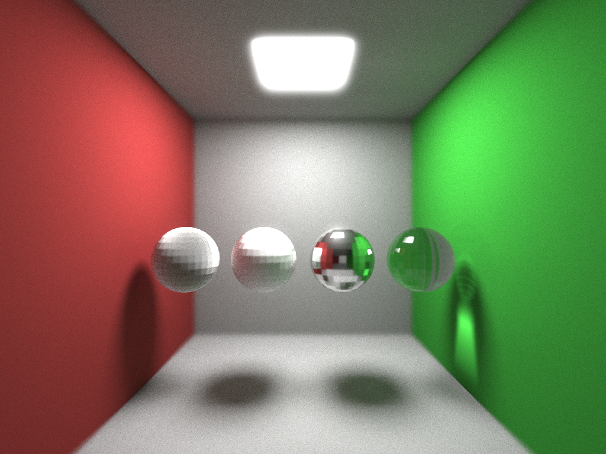

OpenCL Renderer
===============

## Dependencies
To compile you need the OpenCL headers. To run you need any OpenCL driver installed.

## Defining a scene

A scene is defined by three separate files: a .scene file, a .camera file, and a .materials file. Look at the cornel_box files for an example.

##### .scene
|Instruction|Description|
|-----------|-----------|
|load `<.scene\|.materials>`  |  load the camera/materials |
|m `<name>`  | start using the material with `<name>` |
|v `<x>` `<y>` `<z>`  | create a new vertex |
|f `<v1>` `<v2>` `<v3>`  | create a new triangle  |
|load `<.ply>` `<translation>` `<scale>` `<x-axis>` `<y-axis`   | load a mesh from a .ply file |

##### .camera
|Instruction|Description|
|-----------|-----------|
|f `<x>` `<y>` `<z>`  |  camera location |
|t `<x>` `<y>` `<z>`  |  camera focal point |
|a  `<aperture>` |  lens aperture in degrees |
|r  `<radius>` | lens radius  |

##### .materials
Every material begins with `material <name>` and ends with `done`.

|Instruction|Description|
|-----------|-----------|
|c `<r>` `<g>` `<b>`   | reflectance color |
|e `<r>` `<g>` `<b>`  | emission color  |
|t `<brdf>`   | reflection type (lambertian/cook-torrance)  |
|a `<alpha>`  | roughness for cook-torrance  |
|at `<r>` `<g>` `<b>`   | attenuation coefficients  |
|ri `<index>`   | index of refraction  |

## Building and Running
Compile by running `make` in project root directory.

Run with

    $ ./bin/main

Options are:

|Flag|Description|
|----|-----------|
|-i `<file>`             |  Render scene described in `<file>`|
|-h                      |  Print help|
|-o `<file>`             |  Save the output image to `<file>`|
|-p `<num>`              |  Trace a maximum of `<num>` paths for each pixel|
|-r `<radius>`           |  Apply bloom of radius `<radius>`|
|-s `<width>`x`<height>` |  Output an image with the given resolution|

## Samples

Demonstrates volumetric glass. Notice that more light is lost on the thicker parts of the model.

Demonstrates Cook-Torrance brdf with varying roughness. From left to right the alphas are 1.414, 0.7, 0.01, 0.01. Additionally the sphere on the right has an index of refraction of 1.5.
